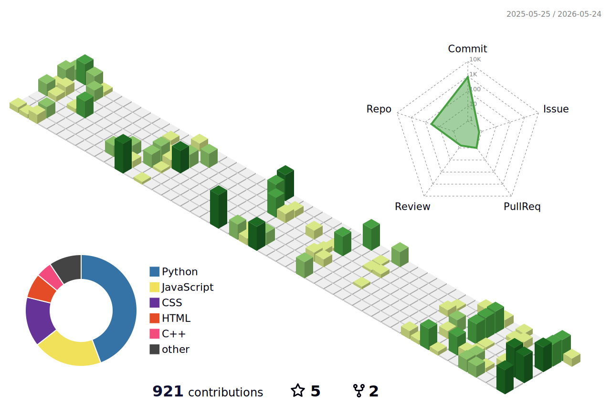

<!-- ═══════════════════════════════════════════════════════ -->
<!--                    HEADER BANNER                       -->
<!-- ═══════════════════════════════════════════════════════ -->

  

<!-- ═══════════════════════════════════════════════════════ -->
<!--                    HEADER / INTRO                      -->
<!-- ═══════════════════════════════════════════════════════ -->

<h1 align="center">
  
</h1>

  
  
  
  
</a>

  
  
  

<picture>
  <source media="(prefers-color-scheme: dark)" srcset="https://raw.githubusercontent.com/KrishBharadwaj5678/KrishBharadwaj5678/output/github-snake-dark.svg" />
  <source media="(prefers-color-scheme: light)" srcset="https://raw.githubusercontent.com/KrishBharadwaj5678/KrishBharadwaj5678/output/github-snake.svg" />
  
</picture>

<!-- ═══════════════════════════════════════════════════════ -->
<!--                      ABOUT ME                          -->
<!-- ═══════════════════════════════════════════════════════ -->

<h2 align="center">About</h2>

  <samp>
    I’m a Full Stack Developer with 3+ years of experience designing and building scalable full stack web applications, Flutter apps, and AR-based web and mobile applications. I specialize in creating high-performance, user-friendly solutions with a strong focus on modern development practices, performance optimization, and clean architecture. I’m passionate about delivering efficient, user-centric digital experiences across platforms. 
  </samp>

## Skills

  
<strong>Full Stack · Mobile · Augmented Reality</strong>

### Full Stack

  

### Mobile

  

### Augmented Reality

  

### Data

  

### Dev Tools

  

## Stats & visuals

  <picture>
    <source media="(prefers-color-scheme: dark)" srcset="./profile-3d-contrib/profile-night-rainbow.svg" />
    
  </picture>

  

